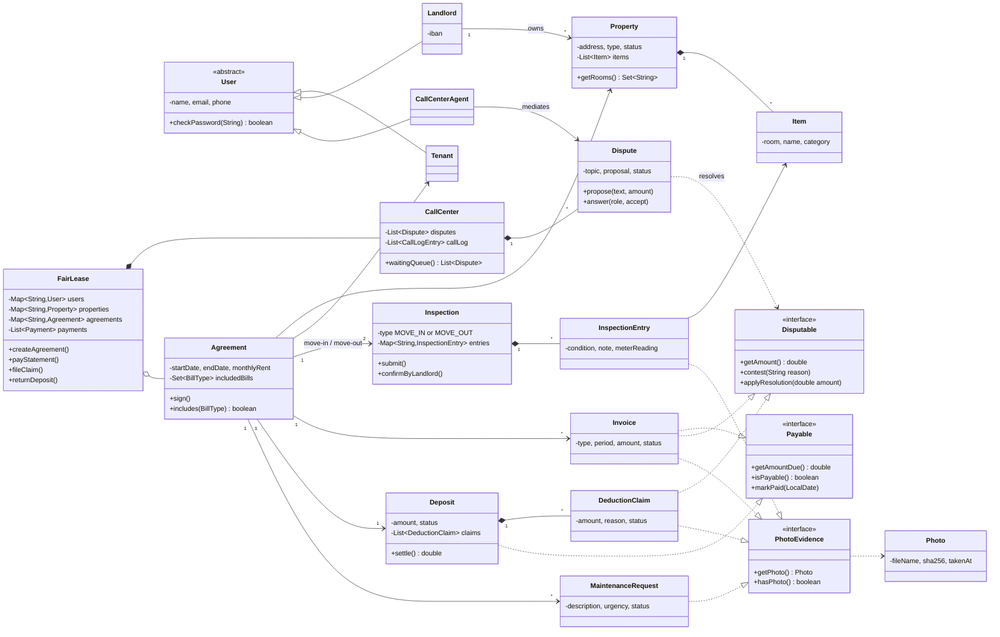

# FairLease - core class diagram (for the presentation)

The full diagram with the user interface, storage and configuration classes is in `class-diagram.md`.

```mermaid
classDiagram
    direction LR

    class Payable {
        <<interface>>
        +getAmountDue() double
        +isPayable() boolean
        +markPaid(LocalDate)
    }
    class Disputable {
        <<interface>>
        +getAmount() double
        +contest(String reason)
        +applyResolution(double amount)
    }
    class PhotoEvidence {
        <<interface>>
        +getPhoto() Photo
        +hasPhoto() boolean
    }

    class User {
        <<abstract>>
        -name, email, phone
        +checkPassword(String) boolean
    }
    class Tenant
    class Landlord {
        -iban
    }
    class CallCenterAgent
    User <|-- Tenant
    User <|-- Landlord
    User <|-- CallCenterAgent

    class Property {
        -address, type, status
        -List~Item~ items
        +getRooms() Set~String~
    }
    class Item {
        -room, name, category
    }
    class Agreement {
        -startDate, endDate, monthlyRent
        -Set~BillType~ includedBills
        +sign()
        +includes(BillType) boolean
    }
    class Inspection {
        -type MOVE_IN or MOVE_OUT
        -Map~String,InspectionEntry~ entries
        +submit()
        +confirmByLandlord()
    }
    class InspectionEntry {
        -condition, note, meterReading
    }
    class Photo {
        -fileName, sha256, takenAt
    }
    class Invoice {
        -type, period, amount, status
    }
    class Deposit {
        -amount, status
        -List~DeductionClaim~ claims
        +settle() double
    }
    class DeductionClaim {
        -amount, reason, status
    }
    class MaintenanceRequest {
        -description, urgency, status
    }
    class Dispute {
        -topic, proposal, status
        +propose(text, amount)
        +answer(role, accept)
    }
    class CallCenter {
        -List~Dispute~ disputes
        -List~CallLogEntry~ callLog
        +waitingQueue() List~Dispute~
    }
    class FairLease {
        -Map~String,User~ users
        -Map~String,Property~ properties
        -Map~String,Agreement~ agreements
        -List~Payment~ payments
        +createAgreement()
        +payStatement()
        +fileClaim()
        +returnDeposit()
    }

    Landlord "1" --> "*" Property : owns
    Property "1" *-- "*" Item
    Agreement --> Property
    Agreement --> Tenant
    Agreement "1" --> "2" Inspection : move-in / move-out
    Inspection "1" *-- "*" InspectionEntry
    InspectionEntry --> Item
    Agreement "1" --> "*" Invoice
    Agreement "1" --> "1" Deposit
    Deposit "1" *-- "*" DeductionClaim
    Agreement "1" --> "*" MaintenanceRequest
    CallCenter "1" *-- "*" Dispute
    CallCenterAgent --> Dispute : mediates
    Dispute ..> Disputable : resolves
    FairLease *-- CallCenter
    FairLease o-- Agreement

    Invoice ..|> Payable
    Deposit ..|> Payable
    Invoice ..|> Disputable
    DeductionClaim ..|> Disputable
    InspectionEntry ..|> PhotoEvidence
    Invoice ..|> PhotoEvidence
    DeductionClaim ..|> PhotoEvidence
    MaintenanceRequest ..|> PhotoEvidence
    PhotoEvidence ..> Photo
```
